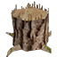

<div style="text-align:center;">
  
</div>

<h1 style="margin-top: 0; text-align: center;">Stump</h1>

Stump is a system tray application written in Go that provides desktop notifications when specified Twitch streamers go live.

## Description

Stump integrates with Twitch to monitor selected streamers and notifies users via desktop notifications when these streamers start broadcasting.

## Features

- Monitors Twitch streamers for live status changes.
- Provides desktop notifications when specified streamers go live.
- Cross-platform support for Windows and Linux.

## Build Instructions

### Using Makefile

Stump includes a Makefile for convenient building:

#### Windows

1. **Build the Executable:** Open Command Prompt or PowerShell and navigate to the project directory.

   ```bash
   make build-windows
   ```
   
    This will compile the executable for Windows (`stump.exe`) in the build directory.


2. To run the application:

    ```bash
   cd /build/stump
    ./stump.exe
    ```

#### Linux

1. **Build the Executable:** Open a terminal and navigate to the project directory.

   ```bash
   make build-linux
   ```

   This will compile the executable for Linux (`stump`) in the build directory.


2. To run the application:

    ```bash
   cd /build/stump
    ./stump
    ```

### Using Go CLI Manually

#### Windows

1. Build the Executable: Open Command Prompt or PowerShell and navigate to the project directory.

    ```bash
    go build -o build/stump.exe ./cmd/stump
    ```
    This will compile the executable for Windows (`stump.exe`) in the build directory.


2. Run the Application: Simply double-click on build/stump.exe or run it from the command line:

    ```bash
    ./build/stump.exe
    ```

#### Linux

1. Build the Executable: Open a terminal and navigate to the project directory.

    ``` bash
    go build -o build/stump ./cmd/stump
    ```
2. Run the Application: Simply double-click on build/stump.exe or run it from the command line:

    ```bash
    ./build/stump
    ```

# Contributing
If you'd like to contribute to Stump, fork the repository and create a pull request. We welcome contributions that improve functionality, add features, or enhance usability.

### Developing using `sqlc`
SQLC is a tool we use that generates type-safe Go code from SQL queries (see `/internal/db`).

- Running sqlc: `docker pull sqlc/sqlc`
  - Run sqlc using docker run: `docker run --rm -v $(pwd):/src -w /src sqlc/sqlc generate`
  - Run sqlc using docker run in cmd on Windows: `docker run --rm -v "%cd%:/src" -w /src sqlc/sqlc generate`

# License
This project is licensed under the GNU License. See the LICENSE file for details.
